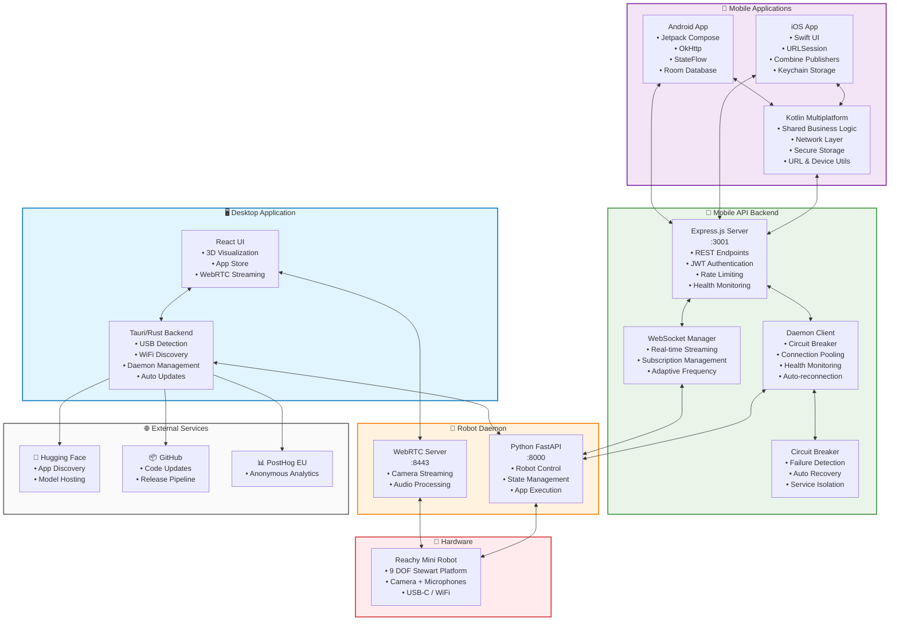
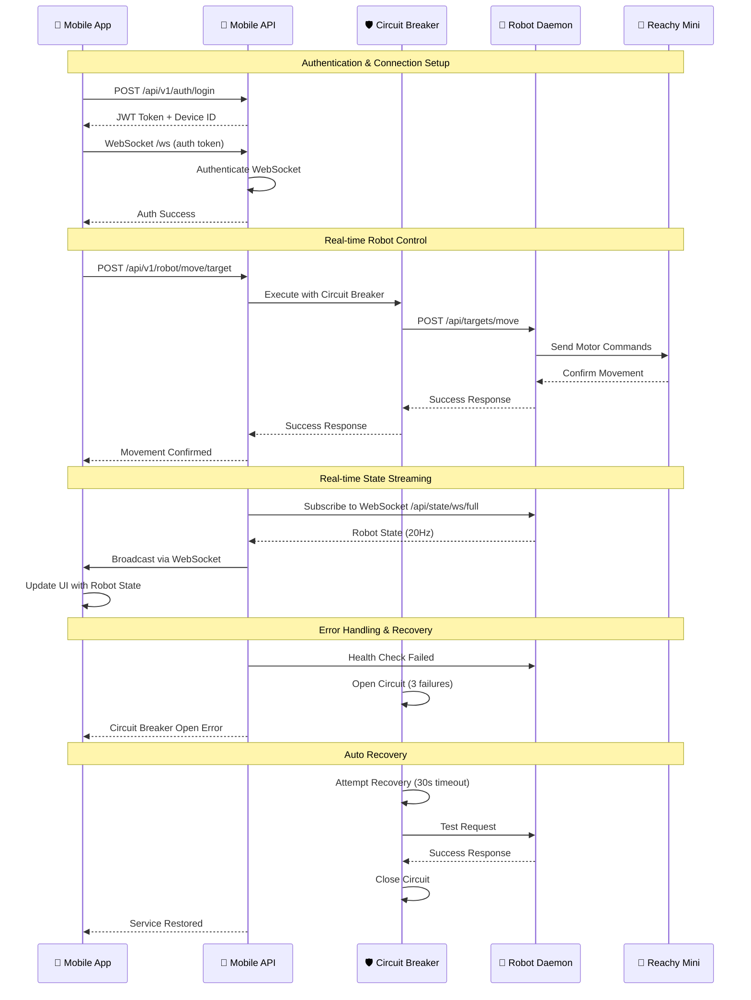
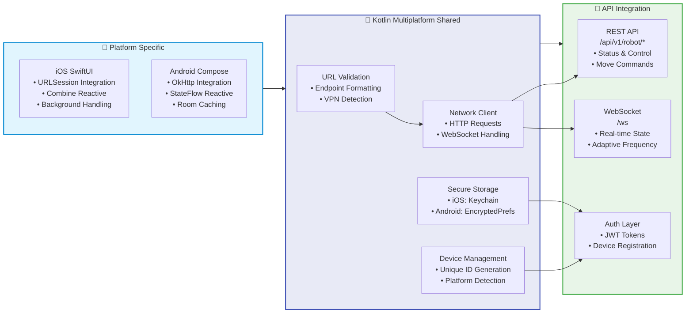
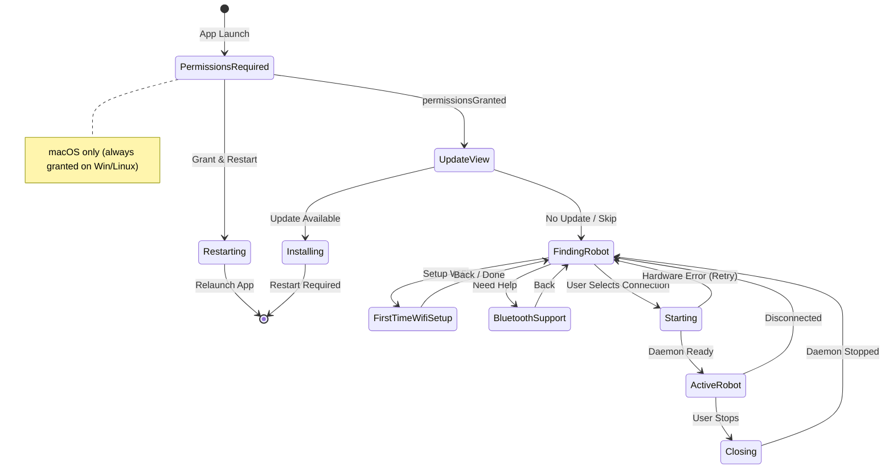

<div align="center">
  <a href="https://huggingface.co/spaces?q=reachy_mini">
    
  </a>
  
  <h1>Reachy Mini Control Ecosystem</h1>

  <p>
    
    
    
    
    
    
  </p>
</div>

A comprehensive cross-platform ecosystem for controlling and monitoring your Reachy Mini robot. Featuring a modern desktop application, mobile apps for iOS and Android, and a unified API backend that enables seamless robot control across all platforms.

> **📢 Platform Support**
> 🖥️ **Desktop Apps**
> ✅ **macOS** - Fully supported and production-ready
> 🚧 **Windows & Linux** - Work in progress, not yet ready for production use
> 📱 **Mobile Apps**
> ✅ **iOS** - Native Swift app with Kotlin Multiplatform integration
> ✅ **Android** - Native Kotlin app with shared business logic
> 🔧 **Backend**
> ✅ **Mobile API** - Express.js REST API with WebSocket streaming and daemon integration

This ecosystem provides unified interfaces across all platforms to manage your Reachy Mini robot. The desktop application handles robot daemon lifecycle and offers real-time 3D visualization, while mobile apps provide convenient remote control capabilities. All platforms share a common API backend with real-time streaming, circuit breaker protection, and comprehensive health monitoring.

## ✨ Features

### 🖥️ **Desktop Application (Tauri + React)**
- 🤖 **Robot Control** - Start, stop, and monitor your Reachy Mini daemon
- 📊 **Real-time 3D Visualization** - Live robot state via WebSocket at 20Hz with URDF model, X-ray effects
- 🏪 **Application Store** - Discover, install, and manage apps from Hugging Face Spaces
  - Browse official and community apps
  - Search and filter by categories
  - One-click installation and removal via deep links or UI
  - Start and stop apps directly from the interface
- 📚 **Create Your Own Apps** - Tutorials and guides to build custom applications
- 📹 **Camera & Audio** - Live WebRTC camera feed with Direction of Arrival (DoA) audio visualization
- 🎮 **Robot Controller** - 2D joystick and sliders for real-time robot position control
- 🔄 **Auto Updates** - Seamless automatic updates with progress tracking
- 🎨 **Modern UI** - Clean, intuitive interface built with Material-UI and Framer Motion
- 🔌 **USB Detection** - Automatic detection of Reachy Mini via USB
- 📶 **WiFi Discovery** - mDNS-based robot discovery with local proxy for Private Network Access
- 🖥️ **Multi-window** - Synchronized state across Tauri windows
- 📊 **Anonymous Telemetry** - Opt-in usage analytics via PostHog EU

### 📱 **Mobile Applications (iOS + Android)**
- 🎯 **Unified Control** - Complete robot control from mobile devices
- 🔄 **Real-time Streaming** - Live robot state updates via WebSocket
- 💾 **Offline Caching** - Robust data persistence with conflict resolution
- 🔐 **Secure Authentication** - JWT-based authentication with device management
- 📱 **Native Performance** - Platform-optimized with shared Kotlin Multiplatform logic
- 🌐 **Network Resilience** - Automatic reconnection and circuit breaker protection
- 🎮 **Touch Controls** - Mobile-optimized robot control interface
- 📊 **Real-time Monitoring** - Robot status and health monitoring

### 🔧 **Mobile API Backend (Express.js + Node.js)**
- 🚀 **REST API** - Comprehensive robot control endpoints (`/api/v1/robot/*`)
- ⚡ **WebSocket Streaming** - Real-time robot state at configurable frequencies (5Hz-20Hz)
- 🛡️ **Circuit Breaker Protection** - Resilient daemon communication with automatic recovery
- 🔐 **Authentication & Security** - JWT tokens, rate limiting, and device management
- 📊 **Health Monitoring** - Comprehensive health checks and connection monitoring
- ⚖️ **Load Balancing** - Connection pooling and adaptive frequency streaming
- 📈 **Metrics & Observability** - Prometheus metrics and structured logging
- 🔄 **Auto-reconnection** - Intelligent retry logic with exponential backoff

### 🌐 **Cross-Platform Integration**
- 📡 **Shared Protocols** - Unified communication protocols across all platforms
- 🔄 **State Synchronization** - Consistent robot state across desktop and mobile
- 🏗️ **Kotlin Multiplatform** - Shared business logic between iOS and Android
- 🔒 **Secure Storage** - Platform-specific secure credential storage
- 🌍 **Network Discovery** - Automatic robot discovery across local networks

## 📱 Mobile Ecosystem

### Mobile API Backend
The mobile API backend (`/mobile-api`) provides a production-ready REST API and WebSocket server for mobile applications:

**Key Features:**
- **Complete Robot Control API** - All robot operations available via REST endpoints
- **Real-time Streaming** - WebSocket-based robot state streaming with adaptive frequency
- **Circuit Breaker Protection** - Resilient daemon communication with automatic failure recovery
- **Authentication & Security** - JWT-based authentication, rate limiting, and CORS protection
- **Health Monitoring** - Comprehensive health checks and connection monitoring
- **Metrics & Observability** - Prometheus metrics and structured logging

**API Endpoints:**
```bash
# Authentication
POST /api/v1/auth/login          # Device authentication
POST /api/v1/auth/register       # Device registration

# Robot Control
GET  /api/v1/robot/status        # Robot status and health
GET  /api/v1/robot/connection    # Connection information
POST /api/v1/robot/connect       # Initiate robot connection
POST /api/v1/robot/disconnect    # Disconnect from robot
GET  /api/v1/robot/state/current # Current robot state snapshot

# Movement Control
POST /api/v1/robot/move/target       # Set movement target
POST /api/v1/robot/move/expression   # Play facial expressions
POST /api/v1/robot/move/choreography # Execute choreography/dance
POST /api/v1/robot/move/wake         # Wake up sequence
POST /api/v1/robot/move/sleep        # Sleep sequence
POST /api/v1/robot/move/stop         # Stop all movement
GET  /api/v1/robot/move/active       # List active moves

# Real-time Streaming
WebSocket /ws                    # Real-time robot state (5Hz-20Hz)

# Health & Monitoring
GET /health                      # Basic health check
GET /health/detailed             # Comprehensive health status
GET /health/robot               # Robot daemon connectivity
```

### Mobile Applications

**iOS Application (`/ios-reachy`):**
- Native Swift UI with Kotlin Multiplatform integration
- URLSession-based networking with circuit breaker support
- Combine publishers for reactive UI updates
- Keychain-based secure credential storage
- Background task support for connection maintenance

**Android Application (`/android-reachy`):**
- Native Kotlin with Jetpack Compose UI
- OkHttp networking with SharedKMP integration
- StateFlow-based reactive architecture
- Room database for offline caching and conflict resolution
- Encrypted SharedPreferences for secure storage

**Shared Logic (`/shared`):**
- Kotlin Multiplatform shared modules
- Common networking layer with platform-specific implementations
- URL validation and endpoint management utilities
- Device ID generation and platform detection
- Secure storage abstractions (iOS Keychain / Android EncryptedPrefs)

## 🚀 Quick Start

### Prerequisites

**Desktop Application:**
- **Node.js 24.4.0+** (LTS recommended) and Yarn
  - If using `nvm`: `nvm install --lts && nvm use --lts`
- Rust (latest stable)
- System dependencies for Tauri ([see Tauri docs](https://v2.tauri.app/start/prerequisites/))
  - **Linux users**: See [Linux Setup Guide](./docs/LINUX_SETUP.md) for detailed installation instructions

**Mobile API Backend:**
- **Node.js 18.0.0+** and npm/yarn
- Optional: Redis, PostgreSQL (falls back to in-memory if not configured)

**Mobile Applications:**
- **iOS**: Xcode 14.0+, iOS 14.0+ deployment target
- **Android**: Android Studio, Kotlin 1.9.22+, Android API 24+ (Android 7.0)

### Installation

**Desktop Application:**
```bash
# Clone the repository
git clone https://github.com/pollen-robotics/reachy-mini-desktop-app.git
cd reachy-mini-desktop-app/reachy_mini_desktop_app

# Install dependencies
yarn install

# Run in development mode
yarn tauri:dev
```

**Mobile API Backend:**
```bash
cd mobile-api

# Install dependencies
npm install

# Start development server
npm run dev
# Server runs on http://localhost:3001
# API documentation available at http://localhost:3001/docs
```

**Mobile Applications:**
```bash
# iOS
cd ios-reachy
open ReachyControl.xcodeproj
# Build and run in Xcode

# Android
cd android-reachy
./gradlew assembleDebug
# Or open in Android Studio

# Test Kotlin Multiplatform shared code
cd shared
./gradlew test
```

```bash
# Check your Node version
node --version

# If using nvm, install and use the latest LTS
nvm install --lts
nvm use --lts
nvm alias default $(nvm version)  # Set as default
```

### Building

**Important**: You must build the sidecar before building the application.

```bash
# 1. Build the sidecar (required first step)
yarn build:sidecar-macos    # macOS
yarn build:sidecar-linux    # Linux
yarn build:sidecar-windows  # Windows

# 2. Build the application
yarn tauri:build            # Build for production (uses PyPI release by default)

# Build for specific platform
yarn tauri build --target aarch64-apple-darwin
yarn tauri build --target x86_64-apple-darwin
yarn tauri build --target x86_64-pc-windows-msvc
yarn tauri build --target x86_64-unknown-linux-gnu
```

#### Installing the daemon from different sources

By default, the `reachy-mini` package is installed from PyPI (latest stable release). You can also install from any GitHub branch by using the `REACHY_MINI_SOURCE` environment variable:

- **PyPI (default)** : `REACHY_MINI_SOURCE=pypi` or omit the variable
- **GitHub branch** : `REACHY_MINI_SOURCE=<branch-name>` (e.g., `develop`, `main`, `feature/xyz`)

Examples to build the sidecar with different sources:
```bash
# macOS - Build with a specific branch
REACHY_MINI_SOURCE=develop bash ./scripts/build/build-sidecar-unix.sh
REACHY_MINI_SOURCE=main bash ./scripts/build/build-sidecar-unix.sh
REACHY_MINI_SOURCE=feature/my-feature bash ./scripts/build/build-sidecar-unix.sh

# Linux - Uses PyInstaller pipeline
REACHY_MINI_SOURCE=develop bash ./scripts/build/build-daemon-pyinstaller.sh
```

> **Note**: macOS uses `build-sidecar-unix.sh` while Linux uses `build-daemon-pyinstaller.sh` for packaging. See [PyInstaller README](./scripts/build/README_PYINSTALLER.md) for details on the Linux pipeline.

## 📖 Documentation

### Guides

- [Linux Setup Guide](./docs/LINUX_SETUP.md) - Linux installation and configuration
- [Linux Packaging Strategy](./docs/LINUX_PACKAGING_STRATEGY.md) - Linux distribution strategy and solutions
- [Scripts Directory](./scripts/README.md) - Organization and usage of build scripts
- [Code Signing](./docs/CODE_SIGNING_REPORT.md) - macOS and Windows code signing documentation
- [Update System](./docs/README.md) - Auto-updater and GitHub Pages deployment
- [Technical Context](./CONTEXT.md) - Hardware specs, streaming, and technical reference
- [Kinematics WASM](./kinematics-wasm/README.md) - WebAssembly kinematics module
- [Telemetry](./docs/TELEMETRY.md) - Anonymous analytics events and opt-out
- [Key Rotation](./KEY_ROTATION.md) - Code signing key rotation procedures
- [Avast SSL Fix](./docs/AVAST_SSL_FIX.md) - Fix for Avast Antivirus SSL issues on Windows
- [E2E Tests](./e2e/README.md) - End-to-end testing with WebdriverIO

### Application Store

The application includes a built-in store for discovering and installing apps:

- **Discover Apps**: Browse apps from Hugging Face Spaces tagged with `reachy_mini`
- **Install & Manage**: Install, uninstall, start, and stop apps with a simple interface
- **Search & Filter**: Find apps by name or filter by categories
- **Deep Links**: Install apps directly via `reachymini://` deep links
- **Create Apps**: Access tutorials to learn how to build your own Reachy Mini applications

Apps are managed through the FastAPI daemon API, which handles installation and execution.

### Running Modes

| Mode | Entry Point | Description |
|------|-------------|-------------|
| **Desktop (Tauri)** | `App.jsx` | Full desktop app with native features (USB, daemon management, updates) |
| **Web Dashboard** | `WebApp.jsx` | Standalone web version for daemon control (build with `yarn build:web`) |
| **Dev Playground** | `DevPlayground.jsx` | Component playground accessible at `/#dev` in development mode |

## 🛠️ Development

### Available Scripts

**Development:**
```bash
yarn dev                    # Start Vite dev server only
yarn tauri:dev              # Run Tauri app in dev mode
yarn tauri:dev:fresh        # Kill daemon, clean, rebuild sidecar, then dev
```

**Building:**
```bash
# Build sidecar (required before tauri:build)
yarn build:sidecar-macos              # macOS (PyPI, uses build-sidecar-unix.sh)
yarn build:sidecar-linux              # Linux (PyPI, uses build-daemon-pyinstaller.sh)
yarn build:sidecar-windows            # Windows (PyPI)

# Build sidecar with specific branch
yarn build:sidecar-macos:develop      # macOS with develop branch
yarn build:sidecar-linux:develop      # Linux with develop branch
yarn build:sidecar-macos:main         # macOS with main branch
yarn build:sidecar-linux:main         # Linux with main branch
yarn build:sidecar:branch             # Interactive branch selection

# Build application
yarn tauri:build                      # Build production bundle

# Build web dashboard (for daemon)
yarn build:web                        # Build web version
yarn deploy:daemon-v2                 # Deploy to daemon dashboard
```

**Updates:**
```bash
yarn build:update:dev       # Build update files for local testing
yarn build:update:prod      # Build update files for production
yarn serve:updates          # Serve updates locally for testing
```

**Testing:**
```bash
yarn test:sidecar           # Test the sidecar build
yarn test:app               # Test the complete application
yarn test:updater           # Test the update system
yarn test:update-prod       # Test production updates
yarn test:all               # Run sidecar + app + updater tests (excludes update-prod)
yarn test:e2e               # Run end-to-end tests with WebdriverIO
```

**Code Quality:**
```bash
yarn lint                   # Run ESLint on src/
yarn lint:fix               # Run ESLint with auto-fix
yarn format                 # Format all files with Prettier
yarn format:check           # Check formatting without writing
```

**Utilities:**
```bash
yarn check-daemon           # Check daemon status and health
yarn kill-daemon            # Stop all running daemon processes
yarn kill-zombie-apps       # Kill zombie app processes
yarn reset-permissions      # Reset macOS permissions (dev)
yarn clean                  # Clean build artifacts
```

### 🔧 Debugging & Diagnostics

**Diagnostic Export (Secret Shortcut):**

Press `Cmd+Shift+D` (Mac) or `Ctrl+Shift+D` (Windows/Linux) anywhere in the app to download a complete diagnostic report. This generates a `.txt` file containing:

- System info (OS, app version, screen size, etc.)
- Robot state (connection mode, status, daemon version, errors)
- Installed apps list
- All frontend logs (last 500)
- All daemon logs
- All app logs (last 500)

**DevTools Access:**
```javascript
// In browser console
window.reachyDiagnostic.download()      // Download as JSON
window.reachyDiagnostic.downloadText()  // Download as readable TXT
window.reachyDiagnostic.copy()          // Copy JSON to clipboard
window.reachyDiagnostic.generate()      // Get report object
```

This is useful for:
- Bug reports and support tickets
- Debugging connection issues
- Analyzing app crashes
- Sharing logs with the development team

### Complete Ecosystem Structure

```
reachy-mini-ecosystem/
├── mobile-api/                       # Mobile API Backend (Express.js + Node.js)
│   ├── src/
│   │   ├── routes/                   # REST API endpoints
│   │   │   ├── robot.js             # Robot control endpoints (/api/v1/robot/*)
│   │   │   ├── auth.js              # Authentication endpoints
│   │   │   ├── health.js            # Health monitoring endpoints
│   │   │   └── ...                  # Other API routes
│   │   ├── services/                # Business logic services
│   │   │   ├── daemonClient.js      # Robot daemon communication client
│   │   │   └── vpnManager.js        # VPN management service
│   │   ├── middleware/              # Express middleware
│   │   │   ├── circuitBreaker.js    # Circuit breaker implementation
│   │   │   ├── auth.js              # JWT authentication middleware
│   │   │   ├── metrics.js           # Prometheus metrics collection
│   │   │   └── errorHandlers.js     # Error handling middleware
│   │   ├── websocket/               # WebSocket implementation
│   │   │   └── manager.js           # WebSocket connection management
│   │   ├── utils/                   # Utility functions
│   │   └── app.js                   # Express app configuration
│   ├── test-daemon-integration.js   # Daemon integration test script
│   ├── package.json                 # Node.js dependencies
│   └── docs/                        # API documentation (OpenAPI)
├── ios-reachy/                      # iOS Native Application
│   ├── ReachyControl/
│   │   ├── Views/                   # SwiftUI views
│   │   ├── Services/                # Network services and URLSession integration
│   │   ├── Models/                  # Data models
│   │   └── Utils/                   # Utility functions
│   ├── ReachyControlTests/           # iOS unit tests
│   ├── ReachyControl.xcodeproj      # Xcode project
│   └── Podfile                     # iOS dependencies
├── android-reachy/                  # Android Native Application
│   ├── app/src/main/java/com/reachy/android/
│   │   ├── ui/                      # Jetpack Compose UI
│   │   ├── data/                    # Repository pattern with Room DB
│   │   ├── network/                 # OkHttp network layer
│   │   ├── di/                      # Dependency injection (Hilt)
│   │   └── utils/                   # Android utilities
│   ├── app/src/test/               # Android unit tests
│   ├── build.gradle.kts            # Android build configuration
│   └── gradle/                     # Gradle wrapper
├── shared/                          # Kotlin Multiplatform Shared Code
│   ├── src/
│   │   ├── commonMain/kotlin/
│   │   │   ├── utils/               # Shared utilities
│   │   │   │   ├── UrlUtils.kt      # URL validation and formatting
│   │   │   │   └── DeviceUtils.kt   # Device ID generation
│   │   │   ├── models/              # Shared data models
│   │   │   ├── network/             # Shared network interfaces
│   │   │   └── platform/            # Platform-specific abstractions
│   │   ├── androidMain/kotlin/      # Android-specific implementations
│   │   │   └── platform/
│   │   │       └── AndroidSecureStorage.kt  # Android secure storage
│   │   ├── iosMain/kotlin/          # iOS-specific implementations
│   │   │   └── platform/
│   │   │       └── IOSSecureStorage.kt      # iOS Keychain integration
│   │   └── commonTest/kotlin/       # Shared tests
│   ├── build.gradle.kts            # KMP build configuration
│   └── gradle/                     # Gradle configuration
└── reachy_mini_desktop_app/         # Desktop Application (Tauri + React)
    ├── src/                              # Frontend React code
│   ├── components/                   # Reusable React components
│   │   ├── viewer3d/                # 3D robot visualization (README.md)
│   │   ├── emoji-grid/              # Emotion wheel and emoji display
│   │   ├── camera/                  # Camera components (standalone CameraStream)
│   │   ├── LogConsole/              # Log display components
│   │   ├── Toast/                   # Toast notifications
│   │   ├── wifi/                    # WiFi configuration components
│   │   ├── ui/                      # Generic UI primitives (StepsProgressIndicator)
│   │   ├── App.jsx                  # Main Tauri application entry
│   │   ├── WebApp.jsx               # Web-only entry (daemon dashboard v2)
│   │   ├── DevPlayground.jsx        # Development playground (/#dev)
│   │   ├── AppTopBar.jsx            # Top bar with controls
│   │   ├── FullscreenOverlay.jsx    # Fullscreen overlay component
│   │   ├── ReachiesCarousel.jsx     # Robot carousel display
│   │   ├── PulseButton.jsx          # Animated pulse button
│   │   └── FPSMeter.jsx             # Performance monitor
│   ├── hooks/                        # Custom React hooks (organized by domain)
│   │   ├── audio/                   # Audio hooks (useDoA)
│   │   ├── daemon/                  # Daemon lifecycle hooks
│   │   │   ├── useDaemon.js         # Start/stop daemon
│   │   │   ├── useDaemonHealthCheck.js  # Health monitoring
│   │   │   ├── useDaemonEventBus.js # Event bus for daemon events
│   │   │   ├── useStartupStages.js  # Startup stage tracking
│   │   │   └── useDaemonStartupLogs.js  # Daemon startup log streaming
│   │   ├── media/                   # Media hooks
│   │   │   ├── useAudioAnalyser.js  # Audio analysis
│   │   │   └── useWebRTCStream.js   # WebRTC streaming
│   │   ├── robot/                   # Robot state hooks
│   │   │   ├── useRobotStateWebSocket.js  # Centralized WebSocket streaming (20Hz)
│   │   │   ├── useRobotCommands.js  # Robot command execution
│   │   │   └── useActiveMoves.js    # Active moves tracking
│   │   ├── system/                  # System hooks
│   │   │   ├── useViewRouter.jsx    # View state machine (priority-based routing)
│   │   │   ├── useUpdater.js        # Auto-update management
│   │   │   ├── useUsbDetection.js   # USB robot detection
│   │   │   ├── usePermissions.js    # macOS permissions
│   │   │   ├── useRobotDiscovery.js # Robot discovery (WiFi/mDNS)
│   │   │   ├── useRobotDiscoveryV2.js # Robot discovery v2
│   │   │   ├── useNetworkStatus.js  # Network connectivity
│   │   │   ├── useLocalWifiScan.js  # Local WiFi network scanning
│   │   │   ├── useDeepLink.js       # Deep link handling (reachymini://)
│   │   │   ├── useUpdateViewState.js # Update view state management
│   │   │   ├── useWindowResize.js   # Window resize handling
│   │   │   ├── useUsbCheckTiming.js # USB check timing logic
│   │   │   └── useLogs.js           # Log management
│   │   ├── useConnection.js         # Connection mode management (USB/WiFi/Simulation)
│   │   ├── useActiveRobotAdapter.js # Adapter for ActiveRobot context (Tauri)
│   │   ├── useWebActiveRobotAdapter.js # Adapter for ActiveRobot context (Web)
│   │   ├── useToast.js              # Toast notification hook
│   │   └── useResizeObserver.js     # Element resize observer
│   ├── views/                        # Main application views
│   │   ├── update/                  # Update checking view
│   │   ├── permissions-required/    # Permissions view (macOS)
│   │   ├── finding-robot/           # Connection selection view
│   │   ├── first-time-wifi-setup/   # WiFi setup wizard (5 steps)
│   │   ├── bluetooth-support/       # Bluetooth help view
│   │   ├── starting/                # Hardware scan view (3D animation)
│   │   ├── closing/                 # Shutdown view
│   │   ├── windows/                 # Multi-window sync (useWindowSync, useWindowFocus)
│   │   └── active-robot/            # Active robot view
│   │       ├── application-store/   # App store (README.md)
│   │       ├── controller/          # Robot controller (README.md)
│   │       ├── audio/               # Audio controls & DoA indicator
│   │       ├── camera/              # Camera feed (WebRTC via context)
│   │       ├── right-panel/         # Right panel (expressions, controller, apps)
│   │       ├── controls/            # Power & sleep buttons
│   │       ├── layout/              # ViewportSwapper
│   │       ├── context/             # ActiveRobotContext
│   │       └── hooks/               # View-specific hooks (wake/sleep, power state)
│   ├── contexts/                     # React contexts
│   │   └── WebRTCStreamContext.jsx  # Shared WebRTC stream (avoids duplicate connections)
│   ├── store/                        # State management (Zustand)
│   │   ├── slices/                  # Store slices (apps, logs, robot, ui)
│   │   ├── middleware/              # Store middleware (windowSync across Tauri windows)
│   │   ├── useStore.js              # Main unified store
│   │   ├── useAppStore.js           # Alias for useStore (backward compat)
│   │   └── storeLogger.js          # Store debug logger
│   ├── utils/                        # Utility functions
│   │   ├── telemetry/               # PostHog analytics integration
│   │   ├── kinematics-wasm/         # WASM bindings for passive joints
│   │   ├── logging/                 # Logging utilities
│   │   ├── viewer3d/                # 3D viewer helpers
│   │   ├── robotModelCache.js       # URDF model caching
│   │   ├── diagnosticExport.js      # Diagnostic report generation
│   │   └── simulationMode.js        # Simulation mode utilities
│   ├── config/                       # Centralized configuration (daemon URLs, timeouts)
│   └── constants/                    # Shared constants (WiFi, robot status, choreographies)
├── src-tauri/                        # Rust backend
│   ├── src/
│   │   ├── lib.rs                   # Main entry point & Tauri command registration
│   │   ├── main.rs                  # Tauri bootstrap
│   │   ├── daemon/                  # Daemon process management
│   │   ├── discovery/               # Robot discovery (mDNS, network scan)
│   │   ├── network/                 # Network utilities
│   │   ├── wifi/                    # WiFi operations
│   │   ├── usb/                     # USB detection (mod.rs + monitor.rs)
│   │   ├── update/                  # Update management
│   │   ├── local_proxy.rs           # TCP/UDP proxy for Private Network Access bypass
│   │   ├── permissions/             # macOS permissions
│   │   ├── signing/                 # Code signing
│   │   ├── python/                  # Python/UV environment management
│   │   └── window/                  # Window management
│   ├── tauri.conf.json              # Base Tauri configuration
│   ├── tauri.macos.conf.json        # macOS-specific config
│   ├── tauri.windows.conf.json      # Windows-specific config
│   ├── tauri.linux.conf.json        # Linux-specific config
│   └── capabilities/                # Security capabilities (permissions)
├── kinematics-wasm/                  # WASM kinematics module (README.md)
├── uv-wrapper/                       # UV wrapper (Rust) for Python env
├── scripts/                          # Build and utility scripts (README.md)
├── e2e/                              # End-to-end tests (WebdriverIO)
└── docs/                             # Additional documentation
```

### Module Documentation

Each major module has its own README with detailed documentation:

| Module | Path | Description |
|--------|------|-------------|
| **Viewer 3D** | [`src/components/viewer3d/README.md`](./src/components/viewer3d/README.md) | 3D visualization, X-ray effects, WebSocket |
| **Application Store** | [`src/views/active-robot/application-store/README.md`](./src/views/active-robot/application-store/README.md) | App discovery, installation, management |
| **Controller** | [`src/views/active-robot/controller/README.md`](./src/views/active-robot/controller/README.md) | Robot position control, joysticks, sliders |
| **Installation** | [`src/views/active-robot/application-store/hooks/installation/README.md`](./src/views/active-robot/application-store/hooks/installation/README.md) | Installation lifecycle and polling |
| **Kinematics WASM** | [`kinematics-wasm/README.md`](./kinematics-wasm/README.md) | WebAssembly passive joints calculation |
| **Scripts** | [`scripts/README.md`](./scripts/README.md) | Build, test, and utility scripts |
| **DMG Assets** | [`src-tauri/dmg-assets/README.md`](./src-tauri/dmg-assets/README.md) | macOS DMG customization guide |
| **Updates** | [`docs/README.md`](./docs/README.md) | Update system documentation |
| **E2E Tests** | [`e2e/README.md`](./e2e/README.md) | End-to-end testing setup |
| **Telemetry** | [`docs/TELEMETRY.md`](./docs/TELEMETRY.md) | Anonymous analytics events |
| **Technical Context** | [`CONTEXT.md`](./CONTEXT.md) | Hardware specs, streaming protocols |

### Complete Ecosystem Architecture



### Mobile API Integration Flow



### Cross-Platform Data Flow



**Key Architecture Points:**
- **Hooks** are organized by domain (daemon, robot, system, media, audio) for better maintainability
- **Views** are organized in dedicated folders with their associated components
- **Store** uses a unified Zustand store with slices (robot, logs, ui, apps) and cross-window sync middleware
- **WebSocket** centralizes robot state streaming at 20Hz via `useRobotStateWebSocket`
- **WebRTC** streams camera via a shared `WebRTCStreamContext` to avoid duplicate connections
- **Local Proxy** (Rust) forwards TCP/UDP traffic to bypass browser Private Network Access restrictions in WiFi mode
- **Adapters** (`useActiveRobotAdapter` / `useWebActiveRobotAdapter`) inject platform-specific behavior into the ActiveRobot context
- **Config** centralizes all configuration constants (timeouts, intervals, etc.)

### View Router State Machine

The application uses a priority-based view router that determines which screen to display based on the current state:



The view router (`useViewRouter`) uses a priority-based system. The first matching condition wins:

| Priority | View | Condition |
|----------|------|-----------|
| 0 | **PermissionsRequired** | `!permissionsGranted` (macOS only, auto-granted on Win/Linux) |
| 1 | **UpdateView** | `shouldShowUpdateView` |
| 2 | **FirstTimeWifiSetup** | `showFirstTimeWifiSetup` (from Zustand store) |
| 2.5 | **BluetoothSupport** | `showBluetoothSupportView` (from Zustand store) |
| 3 | **FindingRobot** | `shouldShowUsbCheck \|\| !connectionMode` |
| 4 | **Starting** | `isStarting \|\| hardwareError` |
| 5 | **Closing** | `isStopping` |
| 6 | **ActiveRobot** | Default (handles its own loading state) |

## 🔄 Updates

The application includes automatic update functionality:

- **Automatic Updates**: Checks for updates on startup and periodically (every hour)
- **Development**: Test updates locally with `yarn build:update:dev` and `yarn serve:updates`
- **Production**: Updates are automatically built, signed, and deployed to GitHub Pages via GitHub Actions
- **Update Endpoint**: `https://pollen-robotics.github.io/reachy-mini-desktop-app/latest.json`

See the [Update System docs](./docs/README.md) for detailed information on auto-updater and GitHub Pages deployment.

## 🤝 Contributing

Contributions are welcome! Please feel free to submit a Pull Request.

1. Fork the repository
2. Create your feature branch (`git checkout -b feature/amazing-feature`)
3. Commit your changes (`git commit -m 'Add some amazing feature'`)
4. Push to the branch (`git push origin feature/amazing-feature`)
5. Open a Pull Request

## 📦 Releasing

This project uses **GitHub's auto-generated release notes** based on PR labels. No manual changelog is maintained.

### Branch Strategy

| Branch | Purpose |
|--------|---------|
| `main` | Production-ready code (protected) |
| `develop` | Integration branch for features |
| `feature/*` | Feature branches |
| `fix/*` | Bug fix branches |

### Release Process

1. **Develop on feature branches**
   ```bash
   git checkout -b feature/my-feature develop
   # ... make changes ...
   git push origin feature/my-feature
   ```

2. **Create a PR to `develop`** with appropriate labels:
   - `feature` or `enhancement` → 🚀 New Features
   - `bug` or `fix` → 🐛 Bug Fixes
   - `improvement` or `refactor` → 🔧 Improvements
   - `build` or `ci` → 📦 Build & CI
   - `docs` or `documentation` → 📝 Documentation

3. **When ready to release**, create a PR from `develop` to `main`

4. **After merging to `main`**, bump versions and create tag:
   ```bash
   # Update version in 3 files:
   # - package.json
   # - src-tauri/Cargo.toml
   # - src-tauri/tauri.conf.json
   
   git commit -m "bump: version X.Y.Z"
   git tag vX.Y.Z
   git push origin main --tags
   ```

5. **GitHub Actions automatically**:
   - Builds for all platforms (macOS, Windows, Linux)
   - Signs binaries (macOS with Developer ID, Windows with certificate)
   - Creates GitHub Release with auto-generated notes
   - Deploys `latest.json` to GitHub Pages for auto-updates

6. **Merge `main` back into `develop`** to sync the version bump:
   ```bash
   git checkout develop
   git merge main
   git push origin develop
   ```
   This ensures `develop` reflects the latest released version and avoids stale version numbers during development.

### Version Files

Three files must be updated together when bumping version:

| File | Field |
|------|-------|
| `package.json` | `"version": "X.Y.Z"` |
| `src-tauri/Cargo.toml` | `version = "X.Y.Z"` |
| `src-tauri/tauri.conf.json` | `"version": "X.Y.Z"` |

### Auto-Generated Files

| File | Generated By | Purpose |
|------|--------------|---------|
| `latest.json` | CI workflow | Auto-updater endpoint (deployed to GitHub Pages) |
| Release notes | GitHub | Based on PR labels via `.github/release.yml` |

## 🎯 Implementation Status

### ✅ **Production Ready**
- **🖥️ Desktop Application** - Fully functional on macOS, Windows/Linux in development
- **🔧 Mobile API Backend** - Complete REST API with circuit breaker protection, WebSocket streaming, and health monitoring
- **📦 Kotlin Multiplatform Shared** - URL utilities, device management, and secure storage abstractions
- **🏗️ Backend Integration** - Comprehensive daemon client with resilience patterns and real-time capabilities

### 🚧 **In Development**
- **📱 iOS Application** - UI components ready, data layer integration in progress
- **📱 Android Application** - Jetpack Compose UI implemented, repository pattern integration in progress
- **🌐 Cross-Platform Features** - Shared business logic and platform-specific optimizations

### 🎯 **Key Accomplishments**
- **Complete Mobile API**: All robot control endpoints implemented with production-grade features
- **Real-time Streaming**: WebSocket-based robot state streaming with adaptive frequency (5Hz-20Hz)
- **Resilience Patterns**: Circuit breaker protection, automatic retry logic, and health monitoring
- **Security**: JWT authentication, rate limiting, CORS protection, and secure storage
- **Observability**: Comprehensive health checks, Prometheus metrics, and structured logging
- **Cross-Platform Foundation**: Kotlin Multiplatform architecture enabling code sharing between iOS and Android

### 📊 **Technical Metrics**
- **API Endpoints**: 15+ REST endpoints for complete robot control
- **Real-time Performance**: 20Hz robot state streaming capability
- **Reliability**: Circuit breaker protection with 3-failure threshold and 30s recovery
- **Security**: JWT-based authentication with device-specific tokens
- **Observability**: 10+ health check endpoints with detailed system monitoring

The ecosystem is designed for production deployment with comprehensive error handling, monitoring, and cross-platform compatibility.

## 📝 License

This project is licensed under the **Apache 2.0 License**. See the [LICENSE](./LICENCE) file for details.

## 🙏 Acknowledgments

- [Tauri](https://tauri.app/) - Framework for building desktop apps
- [React](https://react.dev/) - UI library
- [Material-UI](https://mui.com/) - Component library
- [Reachy Mini](https://www.pollen-robotics.com/reachy-mini/) - The robot this app controls

---

Made with ❤️ for the Reachy Mini community
